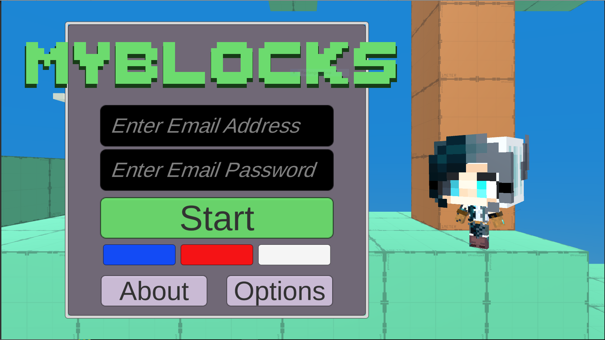

# MyBlocks

[Read More About MyBlocks](https://portfolium.com/entry/25d-mobile-multiplayer-game)

_______________________________________

**MyBlocks** is a 2.5D mobile multiplayer game where players can explore a world together. Fish, craft, skate and fight your way through a world collecting items and crafting weapons with friends!

_______________________________________

I developed the prototype of MyBlocks which inludes core gameplay mechanics such as player movement and a cosmetic UI interface for selecting hats, masks or glasses for your player to wear - an emote dropdown list also included. Additionally, I was in charge of creating all emotes and movement animations. 

_______________________________________

**CosmeticController.cs**: Searches through parented objects on player, storing any objects with the tag 'cosmetic.' Once stored, a helper function can use an index to mark a cosmetic as ON and visible. If the player is already wearing cosmetic, the current cosmetic index is disabled and overriden by the new index.

**DropDownFace.cs**: This scipt is linked directly to a dropdown UI list. On Start, a list of selectable cosmetics is generated based on any cosmetic items that were found by CosmeticController. If the player selects a new cosmetic item from the list, the index of selected item is sent to CosemticController where it is enabled.

